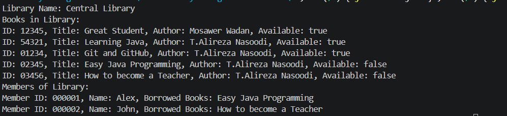

# Library-Management-System 📚

## 📖 Project Overview
A robust, Object-Oriented Java application designed to manage library operations efficiently. This system enables administrators to track book inventory, manage library members, and handle the book borrowing/returning workflow with built-in validation rules.

## 🚀 Key Engineering Features
* **Object-Oriented Design:** Implements clean separation of concerns using `Book`, `Member`, and `Lib` (Library) classes.
* **State Management:** Tracks the availability status of books in real-time, preventing unauthorized borrowing.
* **Data Validation:** * Enforces strict length constraints for `Book ID` (5 characters) and `Member ID` (6 characters).
    * Prevents invalid operations such as borrowing unavailable books or exceeding the maximum limit of 3 borrowed books per member.
* **Robust Error Handling:** Uses `IllegalArgumentException` and `IllegalStateException` to manage domain-specific errors gracefully.

## 🏗️ Technical Architecture
* **Language:** Java (JDK 8+)
* **Architecture:** Object-Oriented Design (OOD)
* **Core Logic:** * `Book`: Stores information about a book and its availability.
    * `Member`: Stores member information and their list of borrowed books.
    * `Lib`: Acts as the central controller for library operations.

## 🛠️ Usage
This application demonstrates core Java capabilities. Upon execution, the system:
1. Initializes the library with a collection of books.
2. Registers new members.
3. Processes borrowing requests with validation checks.
4. Returns books and updates library inventory.
5. Prints the final state of the library, including all books and member activities.

## 📝 How to Run
1. Ensure you have Java installed.
2. Compile the classes: `javac *.java`
3. Run the main application: `java Main`

## 🖥️ Expected Console Output
When the program runs, the system automatically initializes the state of the library and prints the following log:

